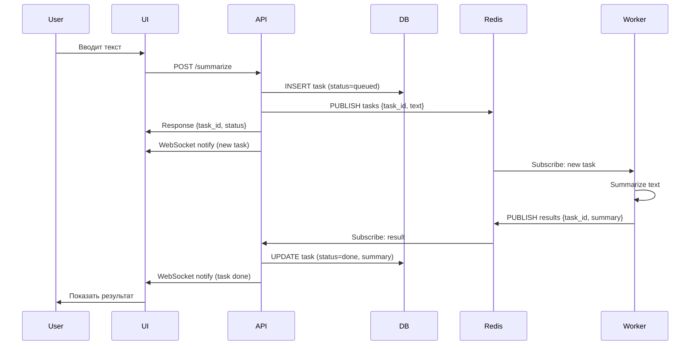

# 🏗️ Архитектура проекта Text Summarizer

## Содержание

- [Общий обзор](#общий-обзор)
- [Архитектурные паттерны](#архитектурные-паттерны)
- [Компоненты системы](#компоненты-системы)
- [Поток данных](#поток-данных)
- [Дизайн решения](#дизайн-решения)
- [Масштабируемость](#масштабируемость)

---

## Общий обзор

Text Summarizer построен на основе **микросервисной архитектуры** с асинхронной обработкой задач. Система использует паттерн **Producer-Consumer** через Redis Pub/Sub для разделения входящих запросов и их обработки.

### Ключевые принципы

1. **Separation of Concerns** — каждый сервис отвечает за свою область
2. **Asynchronous Processing** — долгие операции не блокируют API
3. **Loose Coupling** — компоненты взаимодействуют через абстракции
4. **Extensibility** — легко добавлять новые модели и функциональность

---

## Архитектурные паттерны

### 1. Repository Pattern

**Проблема:** Необходимо поддерживать разные ML-модели (OpenAI, HuggingFace, локальные модели) без изменения бизнес-логики.

**Решение:** Использование паттерна Repository для инкапсуляции логики работы с моделями.

```python
# Интерфейс
class ModelRepository(ABC):
    @abstractmethod
    async def summarize(self, text: str) -> str:
        pass

# Реализации
class OpenAIRepository(ModelRepository):
    async def summarize(self, text: str) -> str:
        # OpenAI API logic
        
class HuggingFaceRepository(ModelRepository):
    async def summarize(self, text: str) -> str:
        # HuggingFace API logic
```

**Преимущества:**
- Легко добавить новую модель
- Бизнес-логика не зависит от конкретной реализации
- Простое тестирование через mock

### 2. Pub/Sub Pattern

**Проблема:** API Gateway не должен блокироваться на время обработки ML-модели (может занять 10+ секунд).

**Решение:** Асинхронная обработка через Redis Pub/Sub.

```
API Gateway --> [Redis: tasks channel] --> Worker
Worker --> [Redis: results channel] --> API Gateway
```

**Преимущества:**
- API отвечает мгновенно
- Worker может горизонтально масштабироваться
- Отказоустойчивость — задачи не теряются

### 3. Factory Pattern

**Проблема:** Выбор конкретной реализации модели в runtime на основе конфигурации.

**Решение:** Factory создает нужный Repository на основе переменной окружения.

```python
def get_repository() -> ModelRepository:
    repo_type = settings.model_backend
    
    if repo_type == "openai":
        return OpenAIRepository()
    elif repo_type == "huggingface":
        return HuggingFaceRepository()
    # ...
```

### 4. WebSocket для Real-Time обновлений

**Проблема:** Клиент должен видеть результат сразу после обработки, без polling.

**Решение:** WebSocket connection для push-уведомлений.

```javascript
// Клиент подписывается на обновления
const ws = new WebSocket('ws://localhost:8000/ws');
ws.onmessage = (event) => {
    const update = JSON.parse(event.data);
    updateUI(update);
};
```

---

## Компоненты системы

### API Gateway (`api_gateway/`)

**Ответственность:**
- Прием HTTP-запросов от клиентов
- Создание задач в базе данных
- Публикация задач в Redis
- Управление WebSocket соединениями
- Отправка уведомлений клиентам

**Технологии:**
- FastAPI — веб-фреймворк
- SQLAlchemy — ORM для работы с БД
- Pydantic — валидация данных
- aioredis — асинхронный Redis клиент

**Endpoints:**
```
POST   /summarize        — создать задачу
GET    /tasks            — получить все задачи
DELETE /tasks/{id}       — удалить задачу
WS     /ws               — WebSocket для уведомлений
GET    /                 — Web UI
```

### Worker (`worker/`)

**Ответственность:**
- Получение задач из Redis
- Вызов ML-модели для суммаризации
- Публикация результатов обратно в Redis
- Обработка ошибок

**Структура:**
```
worker/
├── main.py              # Entry point, подписка на задачи
├── domain/
│   ├── interfaces.py    # Абстрактные интерфейсы
│   ├── factory.py       # Factory для создания Repository
│   └── repositories/    # Конкретные реализации моделей
│       ├── openai_api.py
│       ├── huggingface.py
│       └── local_t5.py
```

### Redis

**Ответственность:**
- Message broker для Pub/Sub
- Очередь задач (`tasks` channel)
- Очередь результатов (`results` channel)

**Почему Redis?**
- Высокая производительность
- Встроенная поддержка Pub/Sub
- Простота развертывания

### Database (SQLite/PostgreSQL)

**Ответственность:**
- Персистентное хранение задач
- История запросов пользователей

**Схема:**
```sql
CREATE TABLE tasks (
    id VARCHAR PRIMARY KEY,
    text TEXT NOT NULL,
    summary TEXT,
    status VARCHAR,  -- queued, processing, done, failed
    created_at TIMESTAMP
);
```

---

## Поток данных

### 1. Создание задачи



### 2. Обработка ошибок

Если Worker падает во время обработки:
1. Задача остается в статусе "queued" в БД
2. Другой Worker может подхватить задачу
3. Можно добавить retry механизм

---

## Дизайн решения

### Почему микросервисы?

**Альтернатива:** Монолит с Celery

**Выбор микросервисов:**
- ✅ Независимое масштабирование API и Worker
- ✅ Разные языки/технологии для разных компонентов
- ✅ Изоляция отказов
- ❌ Сложность развертывания (решается Docker Compose)

### Почему FastAPI?

- Современный, асинхронный фреймворк
- Автоматическая генерация OpenAPI документации
- Встроенная поддержка WebSocket
- Pydantic для валидации данных
- Высокая производительность

### Почему SQLite по умолчанию?

- Простота для development и demo
- Нулевая конфигурация
- Легко мигрировать на PostgreSQL для production

### Почему Redis Pub/Sub, а не RabbitMQ?

**Redis:**
- ✅ Проще в настройке
- ✅ Меньше overhead
- ✅ Достаточно для данного use case
- ❌ Не гарантирует доставку сообщений

**RabbitMQ:**
- ✅ Гарантированная доставка
- ✅ Более сложные сценарии routing
- ❌ Тяжелее и сложнее

Для production критичных систем стоит рассмотреть RabbitMQ.

---

## Масштабируемость

### Горизонтальное масштабирование

**API Gateway:**
```bash
docker-compose up --scale api-gateway=3
```
Добавить Load Balancer (nginx) перед API Gateway.

**Worker:**
```bash
docker-compose up --scale worker=5
```
Каждый Worker будет обрабатывать задачи параллельно.

### Вертикальное масштабирование

- Увеличить ресурсы контейнеров
- Использовать более мощные ML-модели

### Bottlenecks

1. **ML API rate limits** — OpenAI/HuggingFace имеют лимиты запросов
   - Решение: self-hosted модели, батчинг запросов
   
2. **SQLite** — не подходит для высоких нагрузок
   - Решение: миграция на PostgreSQL
   
3. **Redis memory** — хранит все сообщения в памяти
   - Решение: увеличить RAM, использовать Redis Streams

### Оптимизации

- [ ] Кеширование частых запросов
- [ ] Connection pooling для БД
- [ ] Batch обработка задач
- [ ] Compression для больших текстов

---

## Мониторинг и наблюдаемость

### Метрики (потенциал для добавления)

- Request rate, latency
- Task processing time
- Queue depth
- Error rate
- Active WebSocket connections

**Инструменты:**
- Prometheus для сбора метрик
- Grafana для визуализации
- Loki для логов

### Логирование

```python
import logging

logger = logging.getLogger(__name__)
logger.info(f"Task {task_id} received")
logger.error(f"Failed to process task {task_id}: {error}")
```

### Health checks

```python
@app.get("/health")
async def health():
    return {"status": "ok", "redis": check_redis(), "db": check_db()}
```

---

## Безопасность

### Текущая реализация

- Нет аутентификации (подходит для demo)
- WebSocket открыт для всех

### Рекомендации для production

1. **Authentication:**
   - JWT tokens для API
   - WebSocket authentication

2. **Rate limiting:**
   - Ограничение запросов на пользователя
   - Использовать Redis для rate limiting

3. **Input validation:**
   - Максимальная длина текста
   - Sanitization HTML

4. **API Keys:**
   - Хранить в secrets manager (AWS Secrets, HashiCorp Vault)
   - Ротация ключей

---

## Тестирование

### Unit тесты

```python
def test_openai_repository():
    repo = OpenAIRepository()
    result = await repo.summarize("test text")
    assert len(result) > 0
```

### Integration тесты

```python
async def test_task_flow():
    # Создать задачу
    response = await client.post("/summarize", json={"text": "..."})
    task_id = response.json()["task_id"]
    
    # Подождать обработки
    await asyncio.sleep(5)
    
    # Проверить результат
    response = await client.get(f"/tasks/{task_id}")
    assert response.json()["status"] == "done"
```

### E2E тесты

- Selenium для тестирования UI
- WebSocket клиент для проверки real-time обновлений

---

## Roadmap

### Краткосрочные улучшения

- [ ] Rate limiting
- [ ] Retry механизм для Worker
- [ ] Health checks
- [ ] Логирование в структурированном формате

### Долгосрочные улучшения

- [ ] Kubernetes deployment
- [ ] Multi-language support
- [ ] Advanced analytics dashboard
- [ ] User authentication & authorization
- [ ] Webhook callbacks

---

## Заключение

Архитектура Text Summarizer демонстрирует современные подходы к построению масштабируемых асинхронных систем:

✅ **Микросервисы** для гибкости и масштабируемости  
✅ **Асинхронная обработка** для производительности  
✅ **Clean Architecture** для поддерживаемости  
✅ **Docker** для простоты развертывания  

Проект готов к использованию в production после добавления:
- Аутентификации
- Monitoring & alerting
- PostgreSQL вместо SQLite
- Rate limiting
