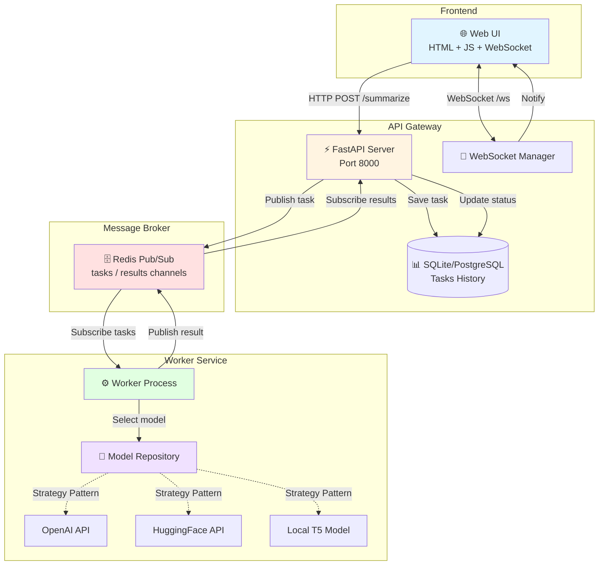

<div align="center">

# 🧠 Text Summarizer

### Асинхронная микросервисная система для суммаризации текста

[](https://www.python.org/)
[](https://fastapi.tiangolo.com/)
[](https://redis.io/)
[](https://www.docker.com/)
[](tests/)
[](LICENSE)

**[Особенности](#-ключевые-особенности) • [Быстрый старт](#-быстрый-старт) • [Архитектура](#-архитектура) • [Технологии](#-технологии) • [API](#-api-endpoints)**

</div>

---

## 📖 О проекте

Современная **микросервисная система** для интеллектуальной суммаризации текста с использованием ML-моделей (OpenAI GPT / HuggingFace). Проект демонстрирует реализацию асинхронной обработки задач через Redis Pub/Sub, real-time обновления через WebSocket и clean architecture с паттерном Repository.

### 🎯 Ключевые особенности

- ⚡ **Асинхронная обработка** — задачи обрабатываются в фоне через Redis Queue
- 🔄 **Real-time обновления** — WebSocket для мгновенного отображения результатов
- 🎨 **Гибкая архитектура** — легко добавить новые ML-модели через паттерн Repository
- 🐳 **Docker-ready** — полная контейнеризация с docker-compose
- 📊 **История задач** — SQLite/PostgreSQL для хранения всех запросов
- 🧩 **Микросервисы** — разделение на API Gateway и Worker

### � Как это работает

```
Пользователь вводит текст
         ↓
   📤 API Gateway 
         ↓
   Redis Pub/Sub (task queue)
         ↓
   ⚙️ Worker (ML обработка)
         ↓
   Redis Pub/Sub (result)
         ↓
   📊 SQLite (сохранение)
         ↓
   🌐 WebSocket (уведомление UI)
```

---

## 🚀 Быстрый старт

### Предварительные требования

- Docker и Docker Compose
- Порты 8000 (API/UI) и 6379 (Redis) должны быть свободны

### Установка и запуск

1. **Клонировать репозиторий**
   ```bash
   git clone https://github.com/loguntsov-ae/TextSummarizer.git
   cd TextSummarizer
   ```

2. **Настроить переменные окружения**
   ```bash
   cp .env.example .env
   # Отредактировать .env и добавить API ключи при необходимости
   ```

3. **Запустить все сервисы**
   ```bash
   docker-compose up --build
   ```

4. **Открыть в браузере**
   ```
   http://localhost:8000
   ```

Готово! 🎉 Введите текст и увидите суммаризацию в реальном времени.

### Альтернативный запуск (через Makefile)

```bash
make up        # Запустить все сервисы
make down      # Остановить сервисы
make logs      # Просмотр логов
make clean     # Очистить данные
```

---

## 🏗️ Архитектура

<div align="center">



</div>

### Описание компонентов

| Компонент | Технология | Назначение |
|-----------|-----------|-----------|
| **API Gateway** | FastAPI + SQLAlchemy | REST API, WebSocket, хранение задач |
| **Worker** | Python asyncio | Асинхронная обработка через ML-модели |
| **Redis** | Redis Pub/Sub | Очередь задач и результатов |
| **Database** | SQLite / PostgreSQL | Персистентное хранилище истории |
| **Web UI** | Vanilla JS | SPA с real-time обновлениями |

---

## 🛠️ Технологии

<table>
<tr>
<td>

**Backend**
- Python 3.11+
- FastAPI
- SQLAlchemy
- Pydantic v2
- asyncio

</td>
<td>

**Infrastructure**
- Docker & Docker Compose
- Redis 7
- Uvicorn
- WebSockets

</td>
<td>

**ML/AI**
- OpenAI API
- HuggingFace Transformers
- T5 Model

</td>
</tr>
</table>

### 🎨 Паттерны и практики

- **Repository Pattern** — абстракция для работы с ML-моделями
- **Pub/Sub Pattern** — асинхронная коммуникация через Redis
- **Dependency Injection** — гибкая конфигурация сервисов
- **Clean Architecture** — разделение бизнес-логики и инфраструктуры

---

## 📡 API Endpoints

### REST API

| Method | Endpoint | Описание |
|--------|----------|----------|
| `POST` | `/summarize` | Создать новую задачу суммаризации |
| `GET` | `/tasks` | Получить список всех задач |
| `DELETE` | `/tasks/{task_id}` | Удалить задачу |
| `GET` | `/` | Web UI интерфейс |

### WebSocket

| Endpoint | Описание |
|----------|----------|
| `WS /ws` | Real-time обновления о статусе задач |

### Пример использования API

```bash
# Создать задачу суммаризации
curl -X POST http://localhost:8000/summarize \
  -H "Content-Type: application/json" \
  -d '{"text": "Your long text here..."}'

# Получить все задачи
curl http://localhost:8000/tasks
```

---

## ⚙️ Конфигурация

### Переменные окружения

Создайте файл `.env` в корне проекта (см. `.env.example`):

```bash
# Redis Configuration
REDIS_URL=redis://redis:6379

# Database
DATABASE_URL=sqlite:///./tasks.db

# ML Model Backend (huggingface | openai | local_t5)
MODEL_BACKEND=huggingface

# OpenAI API (если используется)
OPENAI_API_KEY=your_api_key_here

# HuggingFace API (опционально)
HUGGINGFACE_API_KEY=your_api_key_here
```

### Выбор ML-модели

Измените `MODEL_BACKEND` в `.env`:

- `huggingface` — HuggingFace API (требует ключ)
- `openai` — OpenAI GPT (требует ключ)
- `local_t5` — Локальная модель T5 (без ключа)

---

## 📁 Структура проекта

```
TextSummarizer/
├── api_gateway/              # API Gateway сервис
│   ├── main.py              # FastAPI приложение
│   ├── db.py                # SQLAlchemy модели
│   ├── schemas.py           # Pydantic схемы
│   ├── redis_client.py      # Redis Pub/Sub клиент
│   ├── settings.py          # Конфигурация
│   ├── static/
│   │   └── index.html       # Web UI
│   └── Dockerfile
├── worker/                   # Worker сервис
│   ├── main.py              # Worker процесс
│   ├── redis_client.py      # Redis клиент
│   ├── settings.py          # Конфигурация
│   ├── domain/
│   │   ├── factory.py       # Factory для моделей
│   │   ├── interfaces.py    # Интерфейсы репозиториев
│   │   └── repositories/    # Реализации ML-моделей
│   │       ├── openai_api.py
│   │       ├── huggingface.py
│   │       └── local_t5.py
│   └── Dockerfile
├── docker-compose.yml        # Оркестрация сервисов
├── .env.example             # Шаблон конфигурации
├── Makefile                 # Удобные команды
├── ARCHITECTURE.md          # Детальная архитектура
└── README.md
```

---

## 🧪 Разработка

### Локальный запуск без Docker

**API Gateway:**
```bash
cd api_gateway
pip install -r requirements.txt
uvicorn main:app --reload --port 8000
```

**Worker:**
```bash
cd worker
pip install -r requirements.txt
python main.py
```

**Redis:**
```bash
docker run -p 6379:6379 redis:7-alpine
```

### Тестирование

**Установка зависимостей для тестов:**
```bash
pip install -r requirements-test.txt
```

**Запуск тестов:**
```bash
# Все тесты
make test

# С покрытием кода
make test-cov

# Только unit тесты
make test-unit

# Или напрямую через pytest
pytest tests/ -v

# С покрытием
pytest tests/ --cov=. --cov-report=html
```

**Проверка кода:**
```bash
# Линтер
make lint

# Форматирование
make format
```

**Автоматический запуск тестов:**
```bash
./run_tests.sh
```

---

## 🤝 Contributing

1. Fork проекта
2. Создайте feature branch (`git checkout -b feature/AmazingFeature`)
3. Commit изменения (`git commit -m 'Add some AmazingFeature'`)
4. Push в branch (`git push origin feature/AmazingFeature`)
5. Откройте Pull Request

---

## 📄 Лицензия

Этот проект распространяется под лицензией MIT. См. файл [LICENSE](LICENSE) для деталей.

---

## 🎯 Roadmap

- [ ] Добавить поддержку PostgreSQL
- [ ] Реализовать аутентификацию
- [ ] Добавить метрики (Prometheus + Grafana)
- [ ] Поддержка batch обработки
- [ ] CI/CD pipeline
- [ ] Kubernetes deployment

---

## 👨‍💻 Автор

**Aleksei Loguntsov**

- GitHub: [@loguntsovae](https://github.com/loguntsovae)

---

<div align="center">

**⭐ Если проект был полезен, поставьте звезду! ⭐**

Made with ❤️ using FastAPI & Python

</div>


---

## 🧩 Компоненты

| Сервис | Назначение |
|:--------|:-----------|
| **api-gateway** | HTTP-API, WebSocket-сервис, хранение задач в SQLite, веб-интерфейс |
| **worker** | Асинхронная обработка задач, запрос к ML-модели |
| **redis** | Брокер сообщений (Pub/Sub) |
| **database (SQLite/Postgres)** | Хранит историю задач |

---

## 🛠️ Технологии

- 🐍 **Python 3.11**
- ⚡ **FastAPI**
- 💾 **Redis (asyncio)**
- 🧱 **SQLAlchemy**
- 📦 **Pydantic 2 + pydantic-settings**
- 🌐 **Uvicorn + uv**
- 🔌 **WebSockets**
- 🧰 **Docker / Docker Compose**
- 🎨 **Jinja2 templates (UI)**
- 🧠 **OpenAI API / HuggingFace API**

---

## 🚀 Развёртывание и запуск

### 📋 Предварительные требования
- Установлены **Docker** и **Docker Compose**
- Открытые порты: **8000** (API/UI) и **6379** (Redis)

#### ⚙️ Настройка окружения

Создай файл .env в корне проекта и добавь переменные
